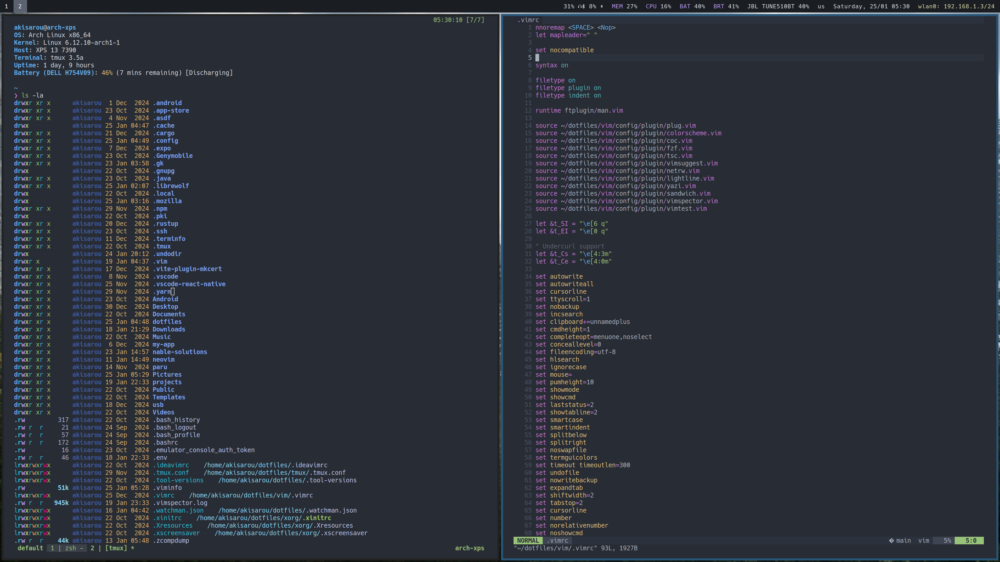

# akisarou dotfiles

This is the configuration of my Arch linux and other useful programs

## Packages

Wayland

- WM: sway
- Bar: waybar
- Terminal: foot
- Menu: rofi-wayland
- Screenshot: grim & grimshot

X11

- WM: i3
- Bar: polybar
- Terminal: st
- Menu: rofi
- Screenshot: flameshot

Common

- Editor: nvim (configured for web dev) | vim (configured for web dev like nvim) | vscode (configuration at .vscode) | zed
- Browsers: librewolf, brave
- Terminal: alacritty | kitty
- Filemanager: yazi, thunar
- Notifications: dunst
- Shell: zsh

Also:

- docker data-root at $HOME/docker
- git config
- fzf, fd
- vscode dark & tokyonight themes
- vscode settings & keybindings at .vscode

* various helper scripts
* change .zprofile to use X11 if wished

## Screenshots

