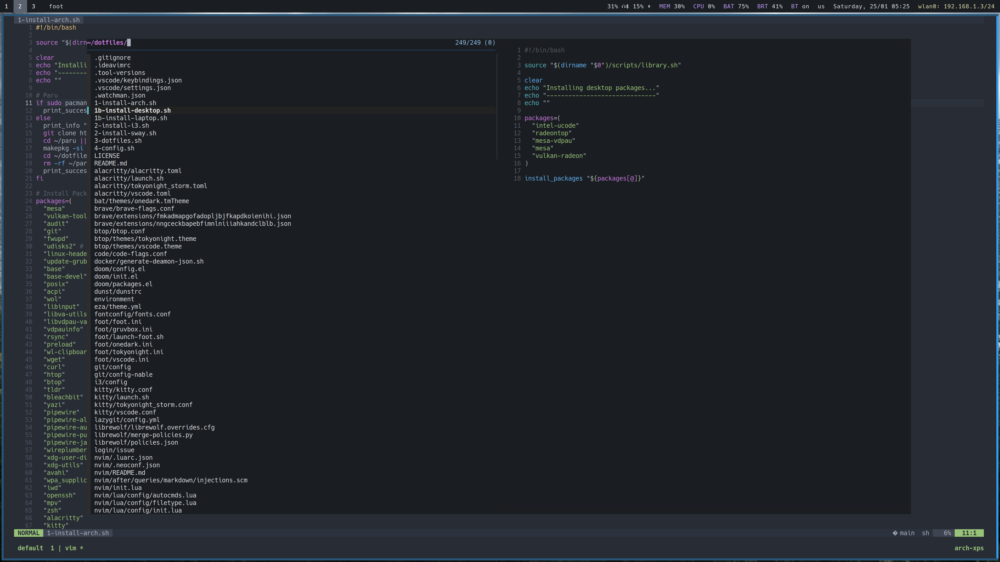
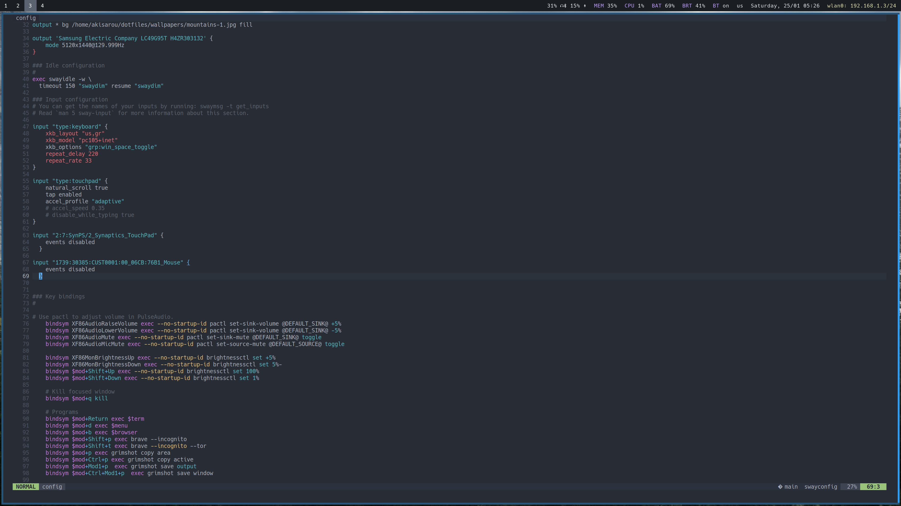
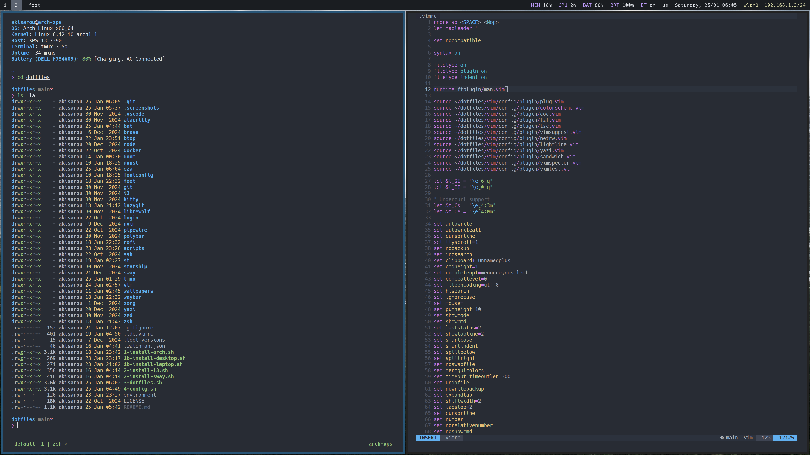

# akisarou dotfiles

This is the configuration of my Arch linux and other useful programs

## Packages

Wayland

- WM: sway
- Bar: waybar
- Terminal: foot

X11

- WM: i3
- Bar: polybar
- Terminal: st

Common

- Editor: nvim (configured for web dev) | vim (minimal config) | vscode (configuration at .vscode) | zed
- Browsers: librewolf, brave
- Terminal: alacritty | kitty
- Filemanager: yazi, thunar
- Notifications: dunst
- Shell: zsh & bash
- Screenshot: flameshot

Also:

- git config
- fzf, fd, rg
- vscode dark & tokyonight themes
- vscode settings & keybindings at .vscode
- various helper scripts

## Screenshots

