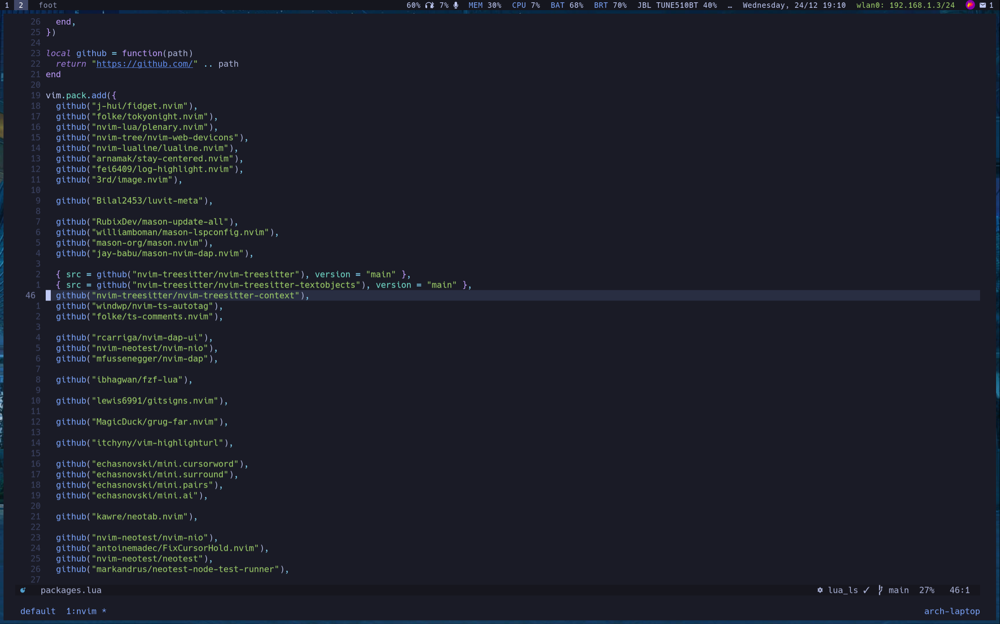
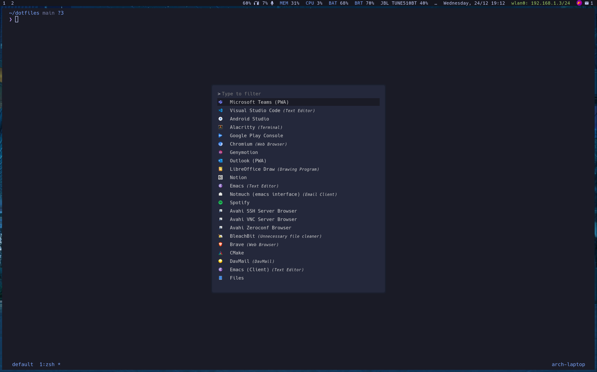
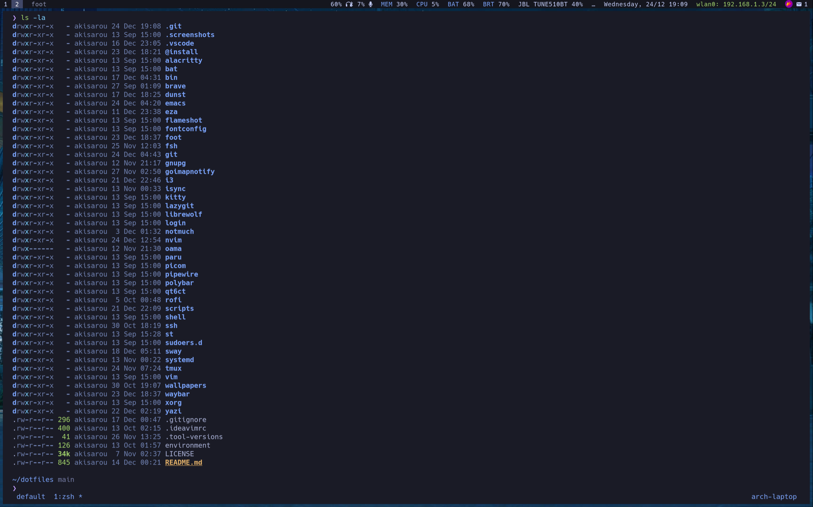

# akisarou dotfiles

This is the configuration of my Arch linux and other useful programs

## Packages

Wayland

- WM: sway
- Bar: waybar
- Terminal: foot

X11

- WM: i3
- Bar: polybar
- Terminal: st

Common

- Editor:
  nvim,
  vim (minimal config),
  vscode (configuration at .vscode)
- Browsers: brave, librewolf
- Terminal: alacritty, kitty
- Filemanager: nautilus
- Notifications: dunst
- Shell: zsh
- Screenshot: flameshot

Also:

- git config
- fzf, fd, rg
- various helper scripts

## Screenshots

